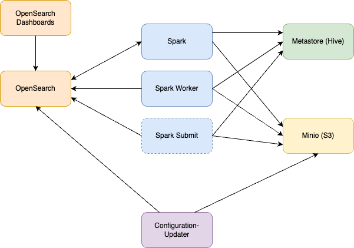
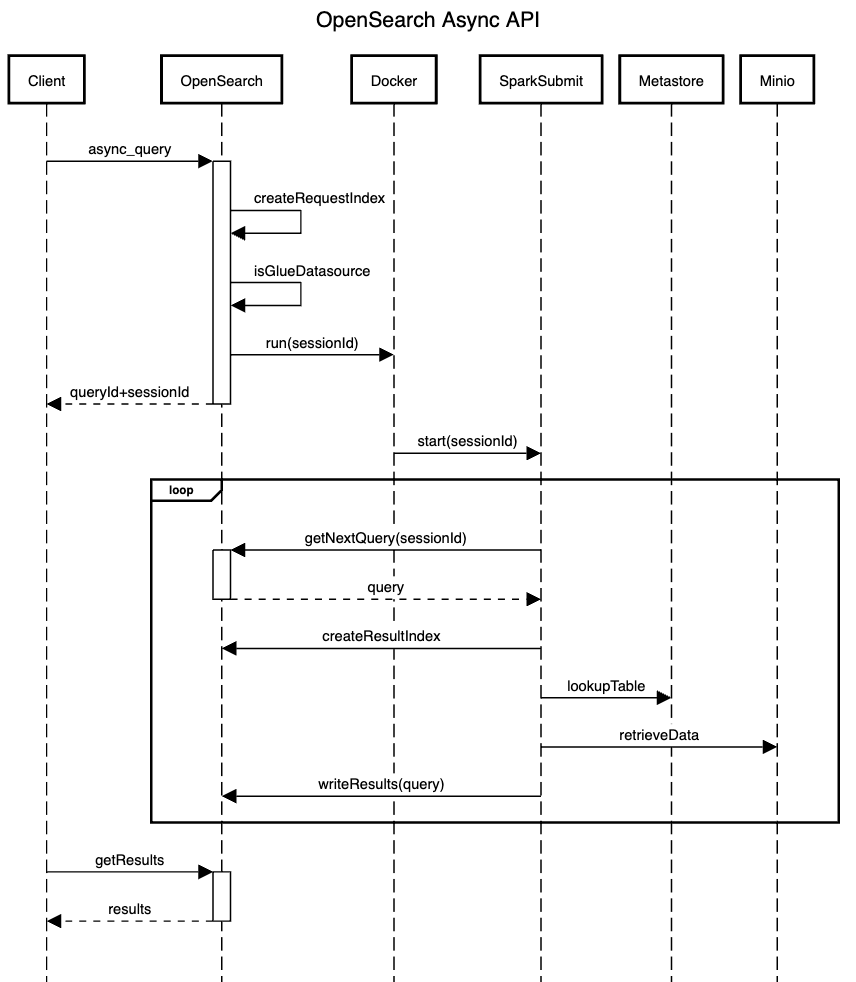

# Docker Cluster for Integration Testing

## Introduction

The docker cluster in `docker/integ-test` is designed to be used for integration testing. It supports the following
use cases:
1. Submitting queries directly to Spark in order to test the PPL extension for Spark.
2. Submitting queries directly to Spark that use the OpenSearch datasource. Useful for testing the Flint extension
   for Spark.
3. Using the Async API to submit queries to the OpenSearch server. Useful for testing the EMR workflow and querying
   S3/Glue datasources. A local container is run rather than using the AWS EMR service.

The cluster consists of several containers and handles configuring them. No tables are created.

## Overview



All containers run in a dedicated docker network.

### OpenSearch Dashboards

An OpenSearch dashboards server that is connected to the OpenSearch server. It is exposed to the host OS,
so it can be accessed with a browser.

### OpenSearch

An OpenSearch server. It is running in standalone mode. It is exposed to the host OS. It is configured to have
an S3/Glue datasource with the name `mys3`. System indices and system indices permissions are disabled.

This container also has a docker volume used to persist data such as local indices.

### Spark

The Spark master node. It is configured to use an external Hive metastore in the container `metastore`. The
Spark master also has the Flint and PPL extensions installed. It can use locally built Jar files when building
the docker image.

Spark Connect is also running in this container and can be used to easily issue queries to run. The port for
Spark Connect is exposed to the host OS.

Spark is configured to have an OpenSearch datastore with the catalog name `dev`. Indices on the OpenSearch
server can be queries as `dev.default.<INDEX_NAME>`.

### Spark Worker

The Spark worker node. It is configured to use an external Hive metastore in the container `metastore`. The
Spark worker also has the Flint and PPL extensions installed. It can use locally built Jar files when building
the docker image.

### Spark Submit

A temporary container that runs queries for an Async API session. It is started the OpenSearch container. It
does not connect to the Spark cluster and instead runs the queries locally. It will keep looking for more
queries to run until it reaches its timeout (3 minutes by default).

The Spark submit container is configured to use an external Hive metastore in the container `metastore`. The
Flint and PPL extensions are installed. When building the docker image, locally built Jar files can be used.

### Metastore (Hive)

A Hive server that is used as a metastore for the Spark containers. It is configured to use the Minio
container in the bucket `integ-test`.

This container also has a docker volume used to persist the metastore.

### Minio (S3)

A Minio server that acts as an S3 server. Is used as a part of the workflow of executing an S3/Glue query.
It will contain the S3 tables data.

This container also has a docker volume used to persist the S3 data.

### Configuration-Updater

A temporary container that is used to configure the OpenSearch and Minio containers. It is run after both
of those have started up. For Minio, it will add the `integ-test` bucket and create an access key. For
OpenSearch, it will create the S3/Glue datasource and apply a cluster configuration.

## Running the Cluster

To start the cluster go to the directory `docker/integ-test` and use docker compose to start the cluster. When
starting the cluster, wait for the `spark-worker` container to finish starting up. It is the last container
to start.

Start cluster in foreground:
```shell
docker compose up
```

Start cluster in the background:
```shell
docker compose up -d
```

Stopping the cluster:
```shell
docker compose down -d
```

## Creating Tables in S3

Tables need to be created in Spark as external tables. Their location must be set to a path under `s3a://integ-test/`.
Can use `spark-shell` on the Spark master container to do this:
```shell
docker exec it spark spark-shell
```

Example for creating a table and adding data:
```scala
spark.sql("CREATE EXTERNAL TABLE foo (id int, name varchar(100)) location 's3a://integ-test/foo'")
spark.sql("INSERT INTO foo (id, name) VALUES(1, 'Foo')")
```

## Querying an S3 Table

A REST call to the OpenSearch container can be used to query the table using the Async API.

[Async Query Creation API](https://github.com/opensearch-project/sql/blob/main/docs/user/interfaces/asyncqueryinterface.rst#async-query-creation-api)
```shell
curl \
  -u 'admin:C0rrecthorsebatterystaple.' \
  -X POST \
  -H 'Content-Type: application/json' \
  -d '{"datasource": "mys3", "lang": "sql", "query": "SELECT * FROM mys3.default.foo"}' \
  http://localhost:9200/_plugins/_async_query
```

Sample response:
```json
{
   "queryId": "HlbM61kX6MDkAktO",
   "sessionId": "1Giy65ZnzNlmsPAm"
}
```

When the query is finished, the results can be retrieved with a REST call to the OpenSearch container.

[Async Query Result API](https://github.com/opensearch-project/sql/blob/main/docs/user/interfaces/asyncqueryinterface.rst#async-query-result-api)
```shell
curl \
  -u 'admin:C0rrecthorsebatterystaple.' \
  -X GET \
  'http://localhost:9200/_plugins/_async_query/HlbM61kX6MDkAktO'
```

Sample response:
```json
{
  "status": "SUCCESS",
  "schema": [
    {
      "name": "id",
      "type": "integer"
    },
    {
      "name": "name",
      "type": "string"
    }
  ],
  "datarows": [
    [
      1,
      "Foo"
    ]
  ],
  "total": 1,
  "size": 1
}
```

## Configuration of the Cluster

There are several settings that can be adjusted for the cluster.

* SPARK_VERSION - the tag of the `bitnami/spark` docker image to use
* OPENSEARCH_VERSION - the tag of the `opensearchproject/opensearch` docker image to use
* DASHBOARDS_VERSION - the tag of the `opensearchproject/opensearch-dashboards` docker image to use
* MASTER_UI_PORT - port on the host OS to map to the master UI port (8080) of the Spark master
* MASTER_PORT - port on the host OS to map to the master port (7077) on the Spark master
* UI_PORT - port on the host OS to map to the UI port (4040) on the Spark master
* SPARK_CONNECT_PORT - port on the host OS to map to the Spark Connect port (15002) on the Spark master
* PPL_JAR - The relative path to the PPL extension Jar file. Must be within the base directory of this repository
* FLINT_JAR - The relative path to the Flint extension Jar file. Must be within the base directory of this
   repository
* SQL_APP_JAR - The relative path to the SQL application Jar file. Must be within the base directory of this
   repository
* OPENSEARCH_NODE_MEMORY - Amount of memory to allocate for the OpenSearch server
* OPENSEARCH_ADMIN_PASSWORD - Password for the admin user of the OpenSearch server
* OPENSEARCH_PORT - port on the host OS to map to port 9200 on the OpenSearch server
* OPENSEARCH_PA_PORT - port on the host OS to map to the performance analyzer port (9600) on the OpenSearch
   server
* OPENSEARCH_DASHBOARDS_PORT - port on the host OS to map to the OpenSearch dashboards server
* S3_ACCESS_KEY - access key to create on the Minio container
* S3_SECRET_KEY - secret key to create on the Minio container

## Async API Overview

[Async API Interfaces](https://github.com/opensearch-project/sql/blob/main/docs/user/interfaces/asyncqueryinterface.rst)

[Async API Documentation](https://opensearch.org/docs/latest/search-plugins/async/index/)

The Async API is able to query S3/Glue datasources. This is done by calling the AWS EMR service to use a
docker container to run the query. The docker container uses Spark and is able to access the Glue catalog and
retrieve data from S3.

For the docker cluster, Minio is used in place of S3. Docker itself is used in place of AWS EMR.



1. Client submit a request to the async_search API endpoint
2. OpenSearch server creates a special index (if it doesn't exist). This index is used to store async API requests
   along with some state information.
3. OpenSearch server checks if the query is for an S3/Glue datasource. If it is not, then OpenSearch can handle
   the request on its own.
4. OpenSearch uses docker to start a new container to process queries for the current async API session.
5. OpenSearch returns the queryId and sessionId to the Client.
6. Spark submit docker container starts up.
7. Spark submit docker container searches for index from step 2 for a query in the current session to run.
8. Spark submit docker container creates a special OpenSearch index (if it doesn't exist). This index is used to
   store the results of the async API queries.
9. Spark submit docker container looks up the table metadata from the `metastore` container.
10. Spark submit docker container retrieves the data from the Minio container.
11. Spark submit docker container writes the results to the OpenSearch index from step 7.
12. Client submits a request to the async_search results API endpoint using the queryId form step 5.
13. OpenSearch returns the results to the Client.
