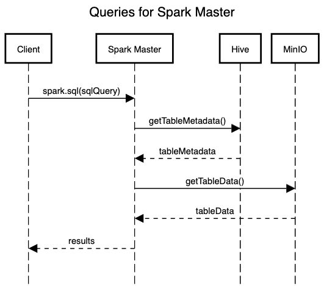
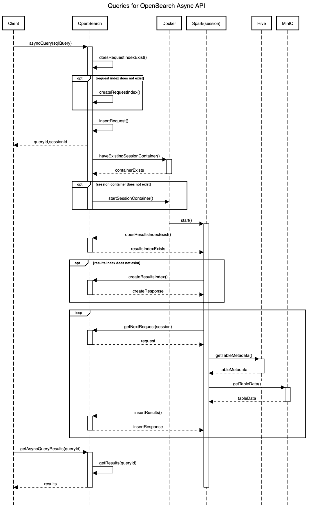

# Query Execution with the Integration Test Docker Cluster

The integration test docker cluster can be used for the following tests:
* SQL/PPL queries on Spark using local tables
* SQL/PPL queries on Spark using external tables with data stored in MinIO(S3)
* SQL/PPL queries on OpenSearch of OpenSearch indices
* SQL/PPL async queries on OpenSearch of data stored in S3

In all cases, SQL or PPL queries be used and the processing is very similar. At most there may be a minor
difference in the query request.

## SQL/PPL Queries on Spark Using Local Tables

Connect directly to the Spark master node and execute a query. Could connect using Spark Connect, submitting
a job or even running `spark-shell` on the Docker container. Execute `sql()` calls on the SparkSession object.

Local tables are tables that were created in Spark that are not external tables. The metadata and data is stored
in the Spark master container.

Spark will begin query processing by assuming that the query is a PPL query. If it fails to parse in PPL, then
it will fall back to parsing it as a SQL query.

After parsing the query, Spark will lookup the metadata for the table(s) and perform the query. The only other
container that may be involved in processing the request is the Spark worker container.

## SQL/PPL Queries on Spark Using External Tables with Data Stored in MinIO(S3)

Connect directly to the Spark master node and execute a query. Could connect using Spark Connect, submitting
a job or even running `spark-shell` on the Docker container. Execute `sql()` calls on the SparkSession object.

External tables are tables that were created in Spark that have an `s3a://` location. The metadata is stored in
Hive and the data is stored in MinIO(S3).

Spark will begin query processing by assuming that the query is a PPL query. If it fails to parse in PPL, then
it will fall back to parsing it as a SQL query.

After parsing the query, Spark will lookup the metadata for the table(s) from Hive and perform the query. It
will retrieve table data from MinIO(S3).

## SQL/PPL Queries on OpenSearch of OpenSearch Indices

Connect directly to the OpenSearch container to submit queries. Use the
[SQL and PPL API](https://opensearch.org/docs/latest/search-plugins/sql/sql-ppl-api/).

The indices are stored in the OpenSearch container.

## SQL/PPL Async Queries on OpenSearch of Data Stored in S3

Connect directly to the OpenSearch container to submit queries. Use the
[Async Query Interface](https://github.com/opensearch-project/sql/blob/main/docs/user/interfaces/asyncqueryinterface.rst).
This type of query simulates querying an S3/Glue datasource in OpenSearch.

The table metadata is stored in Hive and the table data is stored in MinIO(S3).

There are three phases to query processing:
1. Setup
2. Processing
3. Results Retrieval

OpenSearch will use two special indices.
1. `.query_execution_request_[DATASOURCE_NAME]` - In the integration test Docker cluster, the datasource is
   named `mys3`. When an Async Query request is received, an entry is added to this index. The entry contains
   the query as well as its state. The state is updated as the request is processed.
2. `query_execution_result_[DATASOURCE_NAME]` - In the integration test Docker cluster, the datasource is
   named `mys3`. An entry is added to this index when the results are ready. The entry contains the results of
   the query.

Temporary Docker containers are used. They are Apache Spark containers and run a jobs locally.

### Setup

The setup phase is started when OpenSearch receives an Async Query API request and continues until the query
ID and session ID are returned to the client.

1. Check if the index `.query_execution_request_[DATASOURCE_NAME]` exists.
2. If `.query_execution_request_[DATASOURCE_NAME]` does not exist, then create it.
3. Insert the request into `.query_execution_request_[DATASOURCE_NAME]`
4. Return the query ID and session ID

### Processing

The processing phase started when checking if there is a container running for the request's session and
continues until the results are added to the `query_execution_result_[DATASOURCE_NAME]`.

1. Check if there is a Spark container already running for the request's session
2. If a Spark container is not running for the request's session, then use Docker to start one.
   1. Docker initializes and starts the Spark container for the session
3. Spark container checks if the index `query_execution_result_[DATASOURCE_NAME]` exists.
4. If the index `query_execution_result_[DATASOURCE_NAME]` does not exist, then create it.
5. Spark container searches the `.query_execution_request_[DATASOURCE_NAME]` index for the next request
   in the session to process.
6. Spark container identifies the tables in the query and get their metadata from the Hive container
7. Spark container retrieves the table data from the MinIO(S3) container
8. Spark container writes the results to the index `query_execution_result_[DATASOURCE_NAME]`

The Spark container will keep looping from steps 5-8 until it reaches its timeout (currently set to 180 seconds).
Once the timeout is received, the Spark container will shutdown.

### Results Retrieval

The results retrieval phase can happen any time after the results for the query have been added to the index
`query_execution_result_[DATASOURCE_NAME]`.

1. Client request the results of a previously submitted query from the OpenSearch container using the query ID
   received earlier.
2. OpenSearch container searches the index `query_execution_result_[DATASOURCE_NAME]` for the results of the
   query.
3. OpenSearch container returns the query results to the client.