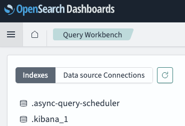
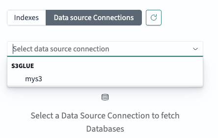
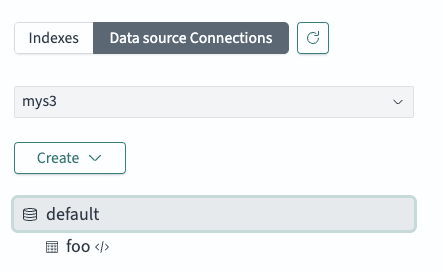
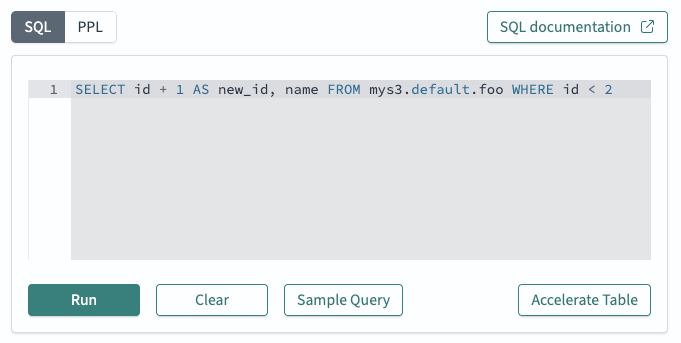

# Using the Query Workbench in OpenSearch Dashboards

The integration test Docker cluster contains an OpenSearch Dashboards container. This container can be used
as a web interface for querying data in the cluster.

[Query Workbench Documentation](https://opensearch.org/docs/latest/dashboards/query-workbench/)

## Logging in to OpenSearch Dashboards

* URL - `http://localhsot:5601`
* Username: `admin`
* Password: The password is in the file `docker/integ-test/.env`. It is the value of `OPENSEARCH_ADMIN_PASSWORD`.

## Querying the S3/Glue Datasource

1. Navigate to the Query Workbench
2. Choose `Data source Connections` in the top left

   
3. In the drop-down below `Data source Connections`, select the S3/Glue datasource. It is named `mys3`.

   
4. It may take some time to load the namespaces in the datasource. `mys3` only contains the namespace `default`.
5. If you like, you can browse the tables in the `default` namespace by clicking on `default`.

   
6. Execute a Query

   
   1. Choose the query language by clicking on `SQL` or `PPL`
   2. Enter a query in the text box
   3. Click `Run` to execute the query
   4. The results are displayed in the bottom right part of the page
