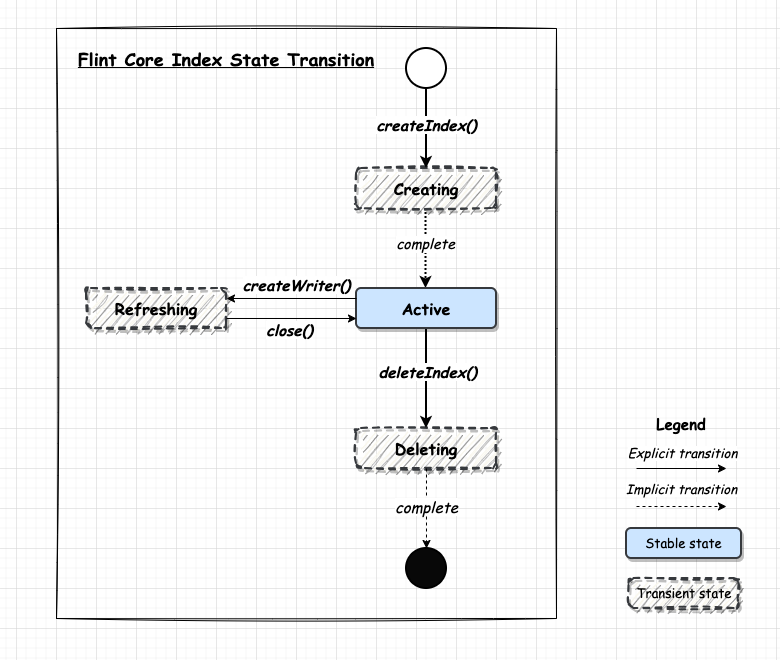
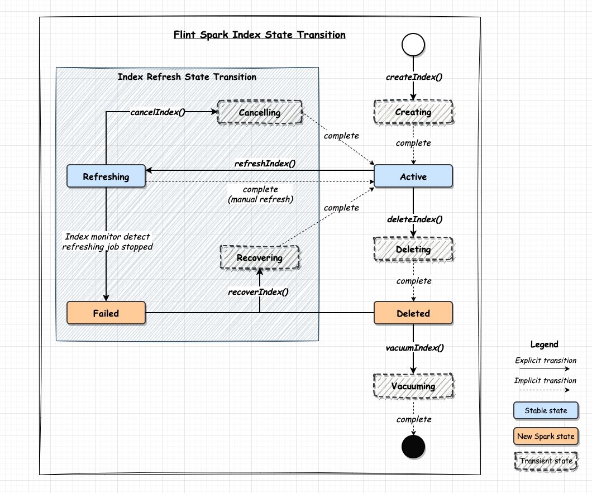

# Flint Index Reference Manual

## Overview

### What is Flint Index?

A Flint index is ...


### Feature Highlights

- Skipping Index: accelerate data scan by maintaining compact aggregate data structure which includes
  - Partition: skip data scan by maintaining and filtering partitioned column value per file.
  - MinMax: skip data scan by maintaining lower and upper bound of the indexed column per file.
  - ValueSet: skip data scan by building a unique value set of the indexed column per file.
  - BloomFilter: skip data scan by building a bloom filter of the indexed column per file.
- Covering Index: create index for selected columns within the source dataset to improve query performance
- Materialized View: enhance query performance by storing precomputed and aggregated data from the source dataset

Please see the following example in which Index Building Logic and Query Rewrite Logic column shows the basic idea behind each skipping index implementation.

| Skipping Index | Create Index Statement                                                                                                                                                                | Index Building Logic                                                                                                                                                                                                                                                                                                    | Query Rewrite Logic                                                                                                                                                                                                                                                                                                                                                       |
|----------------|---------------------------------------------------------------------------------------------------------------------------------------------------------------------------------------|-------------------------------------------------------------------------------------------------------------------------------------------------------------------------------------------------------------------------------------------------------------------------------------------------------------------------|---------------------------------------------------------------------------------------------------------------------------------------------------------------------------------------------------------------------------------------------------------------------------------------------------------------------------------------------------------------------------|
| Partition      | CREATE SKIPPING INDEX<br>ON alb_logs<br> (<br>&nbsp;&nbsp;year PARTITION,<br>&nbsp;&nbsp;month PARTITION,<br>&nbsp;&nbsp;day PARTITION,<br>&nbsp;&nbsp;hour PARTITION<br>) | INSERT INTO flint_alb_logs_skipping_index<br>SELECT<br>&nbsp;&nbsp;FIRST(year) AS year,<br>&nbsp;&nbsp;FIRST(month) AS month,<br>&nbsp;&nbsp;FIRST(day) AS day,<br>&nbsp;&nbsp;FIRST(hour) AS hour,<br>&nbsp;&nbsp;input_file_name() AS file_path<br>FROM alb_logs<br>GROUP BY<br>&nbsp;&nbsp;input_file_name()         | SELECT *<br>FROM alb_logs<br>WHERE year = 2023 AND month = 4<br>=><br>SELECT *<br>FROM alb_logs (input_files = <br>&nbsp;&nbsp;SELECT file_path<br>&nbsp;&nbsp;FROM flint_alb_logs_skipping_index<br>&nbsp;&nbsp;WHERE year = 2023 AND month = 4<br>)<br>WHERE year = 2023 AND month = 4                                                                          |
| ValueSet       | CREATE SKIPPING INDEX<br>ON alb_logs<br> (<br>&nbsp;&nbsp;elb_status_code VALUE_SET<br>)                                                                                   | INSERT INTO flint_alb_logs_skipping_index<br>SELECT<br>&nbsp;&nbsp;COLLECT_SET(elb_status_code) AS elb_status_code,<br>&nbsp;&nbsp;input_file_name() AS file_path<br>FROM alb_logs<br>GROUP BY<br>&nbsp;&nbsp;input_file_name()                                                                                         | SELECT *<br>FROM alb_logs<br>WHERE elb_status_code = 404<br>=><br>SELECT *<br>FROM alb_logs (input_files = <br>&nbsp;&nbsp;SELECT file_path<br>&nbsp;&nbsp;FROM flint_alb_logs_skipping_index<br>&nbsp;&nbsp;WHERE ARRAY_CONTAINS(elb_status_code, 404)<br>)<br>WHERE elb_status_code = 404                                                                       |
| MinMax         | CREATE SKIPPING INDEX<br>ON alb_logs<br> (<br>&nbsp;&nbsp;request_processing_time MIN_MAX<br>)                                                                             | INSERT INTO flint_alb_logs_skipping_index<br>SELECT<br>&nbsp;&nbsp;MIN(request_processing_time) AS request_processing_time_min,<br>&nbsp;&nbsp;MAX(request_processing_time) AS request_processing_time_max,<br>&nbsp;&nbsp;input_file_name() AS file_path<br>FROM alb_logs<br>GROUP BY<br>&nbsp;&nbsp;input_file_name() | SELECT *<br>FROM alb_logs<br>WHERE request_processing_time = 100<br>=><br>SELECT *<br>FROM alb_logs (input_files = <br>  SELECT file_path<br>&nbsp;&nbsp;FROM flint_alb_logs_skipping_index<br>&nbsp;&nbsp;WHERE request_processing_time_min <= 100<br>&nbsp;&nbsp;&nbsp;&nbsp;AND 100 <= request_processing_time_max<br>)<br>WHERE request_processing_time = 100 |
| BloomFilter    | CREATE SKIPPING INDEX<br>ON alb_logs<br> (<br>&nbsp;&nbsp;client_ip BLOOM_FILTER<br>)                                                                                | INSERT INTO flint_alb_logs_skipping_index<br>SELECT<br>&nbsp;&nbsp;BLOOM_FILTER_AGG(client_ip) AS client_ip,<br>&nbsp;&nbsp;input_file_name() AS file_path<br>FROM alb_logs<br>GROUP BY<br>&nbsp;&nbsp;input_file_name()                                                                                   | SELECT *<br>FROM alb_logs<br>WHERE client_ip = '127.0.0.1'<br>=><br>SELECT *<br>FROM alb_logs (input_files = <br>&nbsp;&nbsp;SELECT file_path<br>&nbsp;&nbsp;FROM flint_alb_logs_skipping_index<br>&nbsp;&nbsp;WHERE BLOOM_FILTER_MIGHT_CONTAIN(client_ip, '127.0.0.1')<br>)<br>WHERE client_ip = '127.0.0.1'                                        |

### Flint Index Refresh

- **Auto Refresh:**
  - This feature allows the Flint Index to automatically refresh. Users can configure such as frequency of auto-refresh based on their preferences.
- **Manual Refresh:**
  - Users have the option to manually trigger a refresh for the Flint Index. This provides flexibility and control over when the refresh occurs.
    - **Full Refresh:**
      - Initiates a comprehensive update of the Flint Index, fetching all available data and ensuring the most up-to-date information is displayed.
    - **Incremental Refresh:**
      - Performs an incremental update by fetching only the new data since the last refresh. This is useful for optimizing the refresh process and reducing resource usage.

The refresh mode is influenced by the index options specified during index creation, particularly the `auto_refresh` and `incremental_refresh` options. These options collectively define the behavior of the refresh mode when creating an index as below. Find more details in [Create Index Options](#create-index-options).

| Refresh Mode        | auto_refresh | incremental_refresh |
|---------------------|--------------|---------------------|
| Auto Refresh        | true         |                     |
| Full Refresh        | false        | false               |
| Incremental Refresh | false        | true                |

### Flint Index Specification

#### Metadata

Currently, Flint metadata is only static configuration without version control and write-ahead log.

```json
{
  "version": "0.3.0",
  "name": "...",
  "kind": "skipping",
  "source": "...",
  "indexedColumns": [{
    "kind": "...",
    "columnName": "...",
    "columnType": "..."
  }],
  "options": { },
  "properties": { }
}
```

#### Field Data Type

For now, Flint Index doesn't define its own data type and uses OpenSearch field type instead.

| **FlintDataType** |
|-------------------|
| boolean           |
| binary            |
| long              |
| integer           |
| short             |
| byte              |
| double            |
| float             |
| date              |
| keyword           |
| text              |
| object            |

#### File Format

Please see Index Store section for more details.

## User Guide

### SDK

`FlintClient` provides low-level Flint index management and data access API.

Index management API example:

```java
// Initialized Flint client for a specific storage
FlintClient flintClient = new FlintOpenSearchClient("localhost", 9200);

FlintMetadata metadata = new FlintMetadata(...)
flintClient.createIndex("alb_logs_skipping_index", metadata)

flintClient.getIndexMetadata("alb_logs_skipping_index")
```

Index data read and write example:

```java
FlintClient flintClient = new FlintOpenSearchClient("localhost", 9200);

// read example
FlintReader reader = flintClient.createReader("indexName", null)\
while(reader.hasNext) {
  reader.next()
}
reader.close()

// write example
FlintWriter writer = flintClient.createWriter("indexName")
writer.write("{\"create\":{}}")
writer.write("\n")
writer.write("{\"aInt\":1}")
writer.write("\n")
writer.flush()
writer.close()

```

### Index State Transition

Flint index state transition:



### API

High level API is dependent on query engine implementation. Please see Query Engine Integration section for details.

### SQL

- **CREATE:** Create a Flint index with the specified indexing logic. If the auto-refresh option is enabled, a background job will continually update the index with the latest data from the source.
- **REFRESH:** Manually refresh a Flint index. This command is applicable only to indexes with the auto-refresh option disabled.
- **SHOW:** Display all Flint indexes in the specified catalog or source table.
- **DESCRIBE:** Retrieve detailed information about a Flint index.
- **DROP:** Delete a Flint index logically. This action stops the refreshing process and rules it out in query rewrite.
- **VACUUM:** Physically remove all data associated with a Flint index, including index metadata and data. This operation effectively cleans up and frees resources.

#### Skipping Index

Provided below are the explanations for the parameters of the skipping algorithm. You can find the default values in the function signature below:

- **VALUE_SET(limit=100):** If the column values of a file has higher cardinality than the limit (optional, default is 100), the value set will become null. This trade-off prevents excessive memory consumption at the expense of not skipping the file.

- **BLOOM_FILTER**
  - **BLOOM_FILTER(num_candidate=10, fpp=0.03):** By default, the adaptive BloomFilter algorithm is used. Users can configure:
    1. The number of candidates (optional), starting with an expected number of distinct items at 1024 and doubling.
    2. The false positive probability of each candidate (optional).
    3. Examples: `BLOOM_FILTER`, `BLOOM_FILTER(20), BLOOM_FILTER(20, 0.01)`

  - **BLOOM_FILTER(false, num_items=10000, fpp=0.03):** Setting the first parameter to `false` will revert to the non-adaptive algorithm. Users can configure:
    1. The expected number of distinct values (optional).
    2. The false positive probability (optional).
    3. Examples: `BLOOM_FILTER(false)`, `BLOOM_FILTER(false, 1000000)`, `BLOOM_FILTER(false, 1000000, 0.01)`

```sql
CREATE SKIPPING INDEX [IF NOT EXISTS]
ON <object>
( column <skip_type> <skip_params> [, ...] )
WHERE <filter_predicate>
WITH ( options )

REFRESH SKIPPING INDEX ON <object>

[DESC|DESCRIBE] SKIPPING INDEX ON <object>

DROP SKIPPING INDEX ON <object>

VACUUM SKIPPING INDEX ON <object>

ANALYZE SKIPPING INDEX ON <object>

<object> ::= [db_name].[schema_name].table_name
```

Skipping index type consists of skip type name and optional parameters

```sql
<skip_type> ::= { PARTITION, VALUE_SET, MIN_MAX }

<skip_params> := ( param1, param2, ... )
```

Example:

```sql
CREATE SKIPPING INDEX ON alb_logs
(
  time PARTITION,
  elb_status_code VALUE_SET,
  client_ip VALUE_SET(20),
  request_processing_time MIN_MAX
)
WHERE time > '2023-04-01 00:00:00'

REFRESH SKIPPING INDEX ON alb_logs

DESCRIBE SKIPPING INDEX ON alb_logs

DROP SKIPPING INDEX ON alb_logs

VACUUM SKIPPING INDEX ON alb_logs
```

#### Covering Index

```sql
CREATE INDEX [IF NOT EXISTS] name ON <object>
( column [, ...] )
WHERE <filter_predicate>
WITH ( options )

REFRESH INDEX name ON <object>

SHOW [INDEX|INDEXES] ON <object>

[DESC|DESCRIBE] INDEX name ON <object>

DROP INDEX name ON <object>

VACUUM INDEX name ON <object>
```

Example:

```sql
CREATE INDEX elb_and_requestUri
ON alb_logs ( elb, requestUri )

REFRESH INDEX elb_and_requestUri ON alb_logs

SHOW INDEX ON alb_logs

DESCRIBE INDEX elb_and_requestUri ON alb_logs

DROP INDEX elb_and_requestUri ON alb_logs

VACUUM INDEX elb_and_requestUri ON alb_logs
```

#### Materialized View

```sql
CREATE MATERIALIZED VIEW [IF NOT EXISTS] name
AS <query>
WITH ( options )

REFRESH MATERIALIZED VIEW name

SHOW MATERIALIZED [VIEW|VIEWS] IN catalog[.database]

[DESC|DESCRIBE] MATERIALIZED VIEW name

DROP MATERIALIZED VIEW name

VACUUM MATERIALIZED VIEW name
```

Example:

```sql
CREATE MATERIALIZED VIEW alb_logs_metrics
AS
SELECT
  window.start AS startTime,
  COUNT(*) AS count
FROM alb_logs
GROUP BY TUMBLE(time, '1 Minute')

REFRESH MATERIALIZED VIEW alb_logs_metrics

SHOW MATERIALIZED VIEWS IN spark_catalog.default

DESC MATERIALIZED VIEW alb_logs_metrics

DROP MATERIALIZED VIEW alb_logs_metrics

VACUUM MATERIALIZED VIEW alb_logs_metrics
```

#### All Indexes

- **Show Flint Indexes**: Displays all the flint indexes with their info. It outputs the following columns:
  - flint_index_name: the full OpenSearch index name 
  - kind: type of the index (skipping / covering / mv)
  - database: database name for the index
  - table: table name for skipping and covering index
  - index_name: user defined name for covering index and materialized view
  - auto_refresh: auto refresh option of the index (true / false)
  - status: status of the index

```sql
SHOW FLINT [INDEX|INDEXES] IN catalog[.database]
```

Example:
```
sql> SHOW FLINT INDEXES IN spark_catalog.default;
fetched rows / total rows = 3/3
+-------------------------------------------------------------+----------+----------+-----------+-----------------+--------------+------------+
| flint_index_name                                            | kind     | database | table     | index_name      | auto_refresh | status     |
|-------------------------------------------------------------+----------+----------+-----------+-----------------+--------------+------------|
| flint_spark_catalog_default_http_count_view                 | mv       | default  | NULL      | http_count_view | false        | active     |
| flint_spark_catalog_default_http_logs_skipping_index        | skipping | default  | http_logs | NULL            | true         | refreshing |
| flint_spark_catalog_default_http_logs_status_clientip_index | covering | default  | http_logs | status_clientip | false        | active     |
+-------------------------------------------------------------+----------+----------+-----------+-----------------+--------------+------------+
```

- **Analyze Skipping Index**: Provides recommendation for creating skipping index. It outputs the following columns:
  - column_name: recommended column's name
  - column_type: recommended column's type
  - skipping_type: recommended skipping type for column
  - reason: why this skipping type is recommended

```sql
ANALYZE SKIPPING INDEX ON [catalog.database.]table
```

Example:
```
sql> ANALYZE SKIPPING INDEX ON alb_logs;
fetched rows / total rows = 5/5
+-------------------------+-------------+---------------+-------------------------------------------------------------------+
| column_name             | column_type | skipping_type | reason                                                            |
|-------------------------+-------------+---------------+-------------------------------------------------------------------+
| year                    | integer     | PARTITION     | PARTITION data structure is recommended for partition columns     |
| month                   | integer     | PARTITION     | PARTITION data structure is recommended for partition columns     |
| day                     | integer     | PARTITION     | PARTITION data structure is recommended for partition columns     |
| request_processing_time | integer     | MIN_MAX       | MIN_MAX data structure is recommended for IntegerType columns     |
| client_ip               | string      | BLOOM_FILTER  | BLOOM_FILTER data structure is recommended for StringType columns |
+-------------------------+-------------+---------------+-------------------------------------------------------------------+
```

#### Create Index Options

User can provide the following options in `WITH` clause of create statement:

+ `auto_refresh`: default value is false. Automatically refresh the index if set to true. Otherwise, user has to trigger refresh by `REFRESH` statement manually.
+ `refresh_interval`: a string as the time interval for incremental refresh, e.g. 1 minute, 10 seconds. This is only applicable when auto refresh enabled. Please check `org.apache.spark.unsafe.types.CalendarInterval` for valid duration identifiers. By default, next micro batch will be generated as soon as the previous one complete processing.
+ `incremental_refresh`: default value is false. incrementally refresh the index if set to true. Otherwise, fully refresh the entire index. This only applicable when auto refresh disabled.
+ `checkpoint_location`: a string as the location path for refresh job checkpoint (auto or incremental). The location has to be a path in an HDFS compatible file system and only applicable when auto refresh enabled. If unspecified, temporary checkpoint directory will be used and may result in checkpoint data lost upon restart.
+ `watermark_delay`: a string as time expression for how late data can come and still be processed, e.g. 1 minute, 10 seconds. This is required by incremental refresh on materialized view if it has aggregation in the query.
+ `output_mode`: a mode string that describes how data will be written to streaming sink. If unspecified, default append mode will be applied.
+ `index_settings`: a JSON string as index settings for OpenSearch index that will be created. Please follow the format in OpenSearch documentation. If unspecified, default OpenSearch index settings will be applied.
+ `extra_options`: a JSON string as extra options that can be passed to Spark streaming source and sink API directly. Use qualified source table name (because there could be multiple) and "sink", e.g. '{"sink": "{key: val}", "table1": {key: val}}'

Note that the index option name is case-sensitive. Here is an example:

```sql
WITH (
  auto_refresh = true,
  refresh_interval = '10 Seconds',
  checkpoint_location = 's3://test/',
  watermark_delay = '1 Second',
  output_mode = 'complete',
  index_settings = '{"number_of_shards": 2, "number_of_replicas": 3}',
  extra_options = '{"spark_catalog.default.alb_logs": {"maxFilesPerTrigger": "1"}}'
)
```

Example:

```sql
CREATE INDEX elb_and_requestUri
ON alb_logs ( elb, requestUri )
WITH (
  auto_refresh = true,
  refresh_interval = '1 minute',
  checkpoint_location = 's3://test/'
)
```

### Index Job Management

Currently Flint index job ID is same as internal Flint index name in [OpenSearch](./index.md#OpenSearch) section below.

- **Recover Job**: Initiates a restart of the index refresh job and transition the Flint index to the 'refreshing' state. Additionally, it includes functionality to clean up the metadata log entry in the event that the Flint data index is no longer present in OpenSearch.

```sql
RECOVER INDEX JOB <id>
```

Example:

```sql
RECOVER INDEX JOB `flint_spark_catalog_default_test_skipping_index`
```

## Index Store

### OpenSearch

OpenSearch index corresponding to the Flint index follows the naming convention below:

1. Skipping index: `flint_[catalog_database_table]_skipping_index`
2. Covering index: `flint_[catalog_database_table]_[index_name]_index`
3. Materialized view: `flint_[catalog_database_table]_[mv_name]`

It's important to note that any uppercase letters in the index name and table name (catalog, database and table) in SQL statement will be automatically converted to lowercase due to restriction imposed by OpenSearch.

Examples:

```sql
-- OpenSearch index name is `flint_spark_catalog_default_alb_logs_skipping_index`
CREATE SKIPPING INDEX ON spark_catalog.default.alb_logs ...

-- OpenSearch index name is `flint_spark_catalog_default_alb_logs_elb_and_requesturi_index`
CREATE INDEX elb_and_requestUri ON spark_catalog.default.alb_logs ...
```

In the index mapping, the `_meta` and `properties`field stores meta and schema info of a Flint index.

```json
{
  "_meta": {
    "version": "0.1",
    "indexConfig": {
        "kind": "skipping",
        "properties": {
          "indexedColumns": [
            {
              "kind": "Partition",
              "columnName": "year",
              "columnType": "int"
            },
            {
              "kind": "ValuesSet",
              "columnName": "elb_status_code",
              "columnType": "int"
            }
          ]
        }
    },
    "source": "alb_logs"
  },
  "properties": {
    "year": {
      "type": "integer"
    },
    "elb_status_code": {
      "type": "integer"
    },
    "file_path": {
      "type": "keyword"
    }
  }
}
```

## Query Engine Integration

### Apache Spark

#### Configurations

- `spark.datasource.flint.host`: default is localhost.
- `spark.datasource.flint.port`: default is 9200.
- `spark.datasource.flint.scheme`: default is http. valid values [http, https]
- `spark.datasource.flint.auth`: default is noauth. valid values [noauth, sigv4, basic]
- `spark.datasource.flint.auth.username`: basic auth username.
- `spark.datasource.flint.auth.password`: basic auth password.
- `spark.datasource.flint.region`: default is us-west-2. only been used when auth=sigv4
- `spark.datasource.flint.customAWSCredentialsProvider`: default is empty.   
- `spark.datasource.flint.write.id_name`: no default value.
- `spark.datasource.flint.ignore.id_column` : default value is true.
- `spark.datasource.flint.write.batch_size`: default value is 1000.
- `spark.datasource.flint.write.refresh_policy`: default value is wait_for. valid values [NONE
  (false), IMMEDIATE(true), WAIT_UNTIL(wait_for)]
- `spark.datasource.flint.read.scroll_size`: default value is 100.
- `spark.datasource.flint.read.scroll_duration`: default value is 5 minutes. scroll context keep alive duration.
- `spark.datasource.flint.retry.max_retries`: max retries on failed HTTP request. default value is 3. Use 0 to disable retry.
- `spark.datasource.flint.retry.http_status_codes`: retryable HTTP response status code list. default value is "429,502" (429 Too Many Request and 502 Bad Gateway).
- `spark.datasource.flint.retry.exception_class_names`: retryable exception class name list. by default no retry on any exception thrown.
- `spark.flint.optimizer.enabled`: default is true.
- `spark.flint.index.hybridscan.enabled`: default is false.
- `spark.flint.index.checkpoint.mandatory`: default is true.
- `spark.datasource.flint.socket_timeout_millis`: default value is 60000.

#### Data Type Mapping

The following table define the data type mapping between Flint data type and Spark data type.

| **FlintDataType** | **SparkDataType**                 |
|-------------------|-----------------------------------|
| boolean           | BooleanType                       |
| long              | LongType                          |
| integer           | IntegerType                       |
| short             | ShortType                         |
| byte              | ByteType                          |
| double            | DoubleType                        |
| float             | FloatType                         |
| date(Timestamp)   | DateType                          |
| date(Date)        | TimestampType                     |
| keyword           | StringType, VarcharType, CharType |
| text              | StringType(meta(osType)=text)     |
| object            | StructType                        |

* Currently, Flint data type only support date. it is mapped to Spark Data Type based on the format:
  * Map to DateType if format = strict_date, (we also support format = date, may change in future)
  * Map to TimestampType if format = strict_date_optional_time_nanos, (we also support format =
    strict_date_optional_time | epoch_millis, may change in future)
* Spark data types VarcharType(length) and CharType(length) are both currently mapped to Flint data
  type *keyword*, dropping their length property. On the other hand, Flint data type *keyword* only
  maps to StringType.

Unsupported Spark data types:
* DecimalType
* BinaryType
* YearMonthIntervalType
* DayTimeIntervalType
* ArrayType
* MapType

#### API

Here is an example for Flint Spark integration:

```scala
val flint = new FlintSpark(spark)

// Skipping index
flint.skippingIndex()
    .onTable("spark_catalog.default.alb_logs")
    .filterBy("time > 2023-04-01 00:00:00")
    .addPartitions("year", "month", "day")
    .addValueSet("elb_status_code")
    .addMinMax("request_processing_time")
    .addBloomFilter("client_ip")
    .create()

flint.refreshIndex("flint_spark_catalog_default_alb_logs_skipping_index")

// Covering index
flint.coveringIndex()
    .name("elb_and_requestUri")
    .onTable("spark_catalog.default.alb_logs")
    .addIndexColumns("elb", "requestUri")
    .create()

flint.refreshIndex("flint_spark_catalog_default_alb_logs_elb_and_requestUri_index")

// Materialized view
flint.materializedView()
    .name("spark_catalog.default.alb_logs_metrics")
    .query("SELECT ...")
    .create()

flint.refreshIndex("flint_spark_catalog_default_alb_logs_metrics")

flint.deleteIndex("flint_spark_catalog_default_alb_logs_skipping_index")
flint.vacuumIndex("flint_spark_catalog_default_alb_logs_skipping_index")
```

#### Index State Transition

Flint Spark index state transition:



#### Skipping Index Provider SPI

```scala
trait FlintSparkSkippingStrategy {
  TODO: outputSchema, getAggregators, rewritePredicate
}
```

#### Flint DataSource Read/Write

Here is an example for read index data from AWS OpenSearch domain.

```scala

spark.conf.set("spark.datasource.flint.host", "yourdomain.us-west-2.es.amazonaws.com")
spark.conf.set("spark.datasource.flint.port", "-1")
spark.conf.set("spark.datasource.flint.scheme", "https")
spark.conf.set("spark.datasource.flint.auth", "sigv4")
spark.conf.set("spark.datasource.flint.region", "us-west-2")
spark.conf.set("spark.datasource.flint.refresh_policy", "wait_for")

val df = spark.range(15).toDF("aInt")

val re = df.coalesce(1)
        .write
        .format("flint")
        .mode("overwrite")
        .save("t001")

val df = new SQLContext(sc).read
        .format("flint")
        .load("t001")

```

## Benchmarks

TODO

## Limitations

### Flint Index Naming

Due to the conversion of uppercase letters to lowercase in OpenSearch index names, it is not permissible to create a Flint index with a table name or index name that differs solely by case.

For instance, only one of the statement per group can be successfully:

```sql
-- myGlue vs myglue
CREATE SKIPPING INDEX ON myGlue.default.alb_logs ...
CREATE SKIPPING INDEX ON myglue.default.alb_logs ...

-- idx_elb vs Idx_elb
CREATE INDEX idx_elb ON alb_logs ...
CREATE INDEX Idx_elb ON alb_logs ...
```

### Query Optimization

For now, only single or conjunct conditions (conditions connected by AND) in WHERE clause can be optimized by skipping index.

## Integration

### AWS EMR Spark Integration - Using execution role
Flint use [DefaultAWSCredentialsProviderChain](https://docs.aws.amazon.com/AWSJavaSDK/latest/javadoc/com/amazonaws/auth/DefaultAWSCredentialsProviderChain.html). When running in EMR Spark, Flint use executionRole credentials
```
--conf spark.jars.packages=org.opensearch:opensearch-spark-standalone_2.12:0.3.0-SNAPSHOT \
--conf spark.jars.repositories=https://aws.oss.sonatype.org/content/repositories/snapshots \
--conf spark.emr-serverless.driverEnv.JAVA_HOME=/usr/lib/jvm/java-17-amazon-corretto.x86_64 \
--conf spark.executorEnv.JAVA_HOME=/usr/lib/jvm/java-17-amazon-corretto.x86_64 \
--conf spark.datasource.flint.host=opensearch-domain.us-west-2.es.amazonaws.com \
--conf spark.datasource.flint.port=-1 \
--conf spark.datasource.flint.scheme=https \
--conf spark.datasource.flint.auth=sigv4 \
--conf spark.datasource.flint.region=us-west-2 \
```

### AWS EMR Serverless Spark Integration - Using Assume Role
1. In AccountB, add trust relationship to arn:aws:iam::AccountB:role/CrossAccountRoleB
```
{
  "Version": "2012-10-17",
  "Statement": [
    {
      "Effect": "Allow",
      "Principal": {
        "AWS": "arn:aws:iam::AccountA:role/JobExecutionRoleA"
      },
      "Action": "sts:AssumeRole"
    }
  ]
}
```
2. In AccountA, add STS assume role permission to arn:aws:iam::AccountA:role/JobExecutionRoleA
```
{
  "Version": "2012-10-17",
  "Statement": [
    {
      "Effect": "Allow",
      "Action": "sts:AssumeRole",
      "Resource": "arn:aws:iam::AccountB:role/CrossAccountRoleB"
    }
  ]
}
```
3. Set the spark.datasource.flint.customAWSCredentialsProvider property with value as com.amazonaws.emr.AssumeRoleAWSCredentialsProvider. Set the environment variable ASSUME_ROLE_CREDENTIALS_ROLE_ARN with the ARN value of CrossAccountRoleB.
```
--conf spark.jars.packages=org.opensearch:opensearch-spark-standalone_2.12:0.3.0-SNAPSHOT \
--conf spark.jars.repositories=https://aws.oss.sonatype.org/content/repositories/snapshots \
--conf spark.emr-serverless.driverEnv.JAVA_HOME=/usr/lib/jvm/java-17-amazon-corretto.x86_64 \
--conf spark.executorEnv.JAVA_HOME=/usr/lib/jvm/java-17-amazon-corretto.x86_64 \
--conf spark.datasource.flint.host=opensearch-domain.us-west-2.es.amazonaws.com \
--conf spark.datasource.flint.port=-1 \
--conf spark.datasource.flint.scheme=https \
--conf spark.datasource.flint.auth=sigv4 \
--conf spark.datasource.flint.region=us-west-2 \
--conf spark.datasource.flint.customAWSCredentialsProvider=com.amazonaws.emr.AssumeRoleAWSCredentialsProvider \
--conf spark.emr-serverless.driverEnv.ASSUME_ROLE_CREDENTIALS_ROLE_ARN=arn:aws:iam::AccountB:role/CrossAccountRoleB \
--conf spark.executorEnv.ASSUME_ROLE_CREDENTIALS_ROLE_ARN=arn:aws:iam::AccountBB:role/CrossAccountRoleB
```

### Basic Auth
Add Basic Auth configuration in Spark configuration. Replace username and password with correct one.
```
--conf spark.datasource.flint.auth=basic
--conf spark.datasource.flint.auth.username=username
--conf spark.datasource.flint.auth.password=password
```
