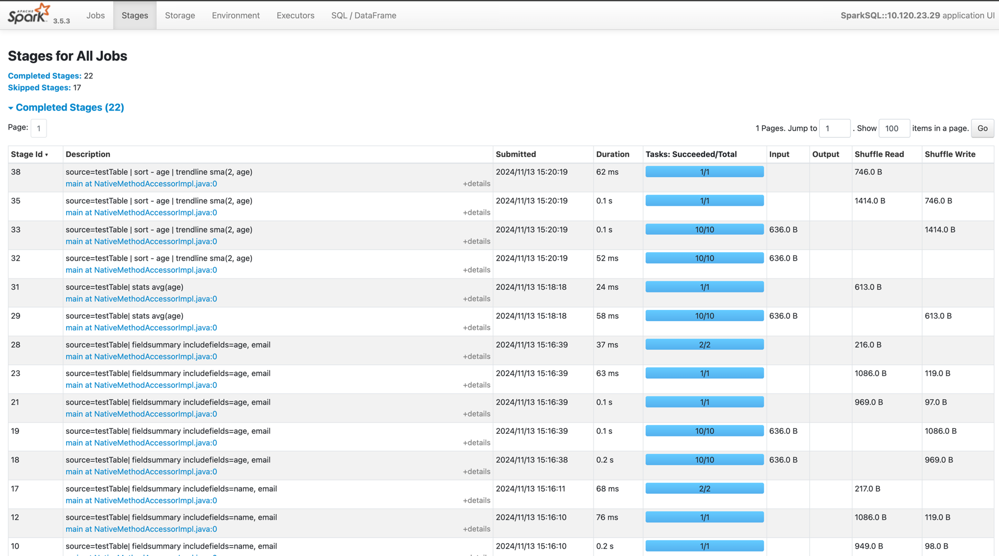

# Testing PPL using local Spark

## Produce the PPL artifact
The first step would be to produce the spark-ppl artifact: `sbt clean sparkPPLCosmetic/assembly`

The resulting artifact would be located in the project's build directory:
```sql
[info] Built: ./opensearch-spark/sparkPPLCosmetic/target/scala-2.12/opensearch-spark-ppl-assembly-x.y.z-SNAPSHOT.jar
```
## Downloading spark 3.5.3 version
Download spark from the [official website](https://spark.apache.org/downloads.html) and install locally.

## Start Spark with the plugin
Once installed, run spark with the generated PPL artifact: 
```shell
bin/spark-sql --jars "/PATH_TO_ARTIFACT/opensearch-spark-ppl-assembly-x.y.z-SNAPSHOT.jar" \
--conf "spark.sql.extensions=org.opensearch.flint.spark.FlintPPLSparkExtensions"  \
--conf "spark.sql.catalog.dev=org.apache.spark.opensearch.catalog.OpenSearchCatalog" \
--conf "spark.hadoop.hive.cli.print.header=true"

WARN NativeCodeLoader: Unable to load native-hadoop library for your platform... using builtin-java classes where applicable
Setting default log level to "WARN".
To adjust logging level use sc.setLogLevel(newLevel). For SparkR, use setLogLevel(newLevel).
WARN HiveConf: HiveConf of name hive.stats.jdbc.timeout does not exist
WARN HiveConf: HiveConf of name hive.stats.retries.wait does not exist
WARN ObjectStore: Version information not found in metastore. hive.metastore.schema.verification is not enabled so recording the schema version 2.3.0
WARN ObjectStore: setMetaStoreSchemaVersion called but recording version is disabled: version = 2.3.0, comment = Set by MetaStore 
Spark Web UI available at http://*.*.*.*:4040
Spark master: local[*], Application Id: local-1731523264660

spark-sql (default)>
```
The resulting would be a spark-sql prompt: `spark-sql (default)> ...`

### Spark UI Html 
One can also explore spark's UI portal to examine the execution jobs and how they are performing:




### Configuring hive partition mode
For simpler configuration of partitioned tables, use the following non-strict mode:

```shell
spark-sql (default)> SET hive.exec.dynamic.partition.mode = nonstrict;
```

---

# Testing PPL Commands

In order to test ppl commands using the spark-sql command line - create and populate the following set of tables:

## emails table
```sql
CREATE TABLE emails (name STRING, age INT, email STRING, street_address STRING, year INT, month INT) PARTITIONED BY (year, month);
INSERT INTO emails (name, age, email, street_address, year, month) VALUES ('Alice', 30, 'alice@example.com', '123 Main St, Seattle', 2023, 4), ('Bob', 55, 'bob@test.org', '456 Elm St, Portland', 2023, 5), ('Charlie', 65, 'charlie@domain.net', '789 Pine St, San Francisco', 2023, 4), ('David', 19, 'david@anotherdomain.com', '101 Maple St, New York', 2023, 5), ('Eve', 21, 'eve@examples.com', '202 Oak St, Boston', 2023, 4), ('Frank', 76, 'frank@sample.org', '303 Cedar St, Austin', 2023, 5), ('Grace', 41, 'grace@demo.net', '404 Birch St, Chicago', 2023, 4), ('Hank', 32, 'hank@demonstration.com', '505 Spruce St, Miami', 2023, 5), ('Ivy', 9, 'ivy@examples.com', '606 Fir St, Denver', 2023, 4), ('Jack', 12, 'jack@sample.net', '707 Ash St, Seattle', 2023, 5);
```

Now one can run the following ppl commands to test functionality:

### Test `describe` command

```sql
describe emails;

col_name	data_type	comment
name                	string              	                    
age                 	int                 	                    
email               	string              	                    
street_address      	string              	                    
year                	int                 	                    
month               	int                 	                    
# Partition Information	                    	                    
# col_name          	data_type           	comment             
year                	int                 	                    
month               	int                 	                    
                    	                    	                    
# Detailed Table Information	                    	                    
Catalog             	spark_catalog       	                    
Database            	default             	                    
Table               	emails           	                    
Owner               	USER            	                    
Created Time        	Wed Nov 13 14:45:12 MST 2024	                    
Last Access         	UNKNOWN             	                    
Created By          	Spark 3.5.3         	                    
Type                	MANAGED             	                    
Provider            	hive                	                    
Table Properties    	[transient_lastDdlTime=1731534312]	                    
Location            	file:/Users/USER/tools/spark-3.5.3-bin-hadoop3/bin/spark-warehouse/emails	                    
Serde Library       	org.apache.hadoop.hive.serde2.lazy.LazySimpleSerDe	                    
InputFormat         	org.apache.hadoop.mapred.TextInputFormat	                    
OutputFormat        	org.apache.hadoop.hive.ql.io.HiveIgnoreKeyTextOutputFormat	                    
Storage Properties  	[serialization.format=1]	                    
Partition Provider  	Catalog             	                    

Time taken: 0.128 seconds, Fetched 28 row(s)
```

### Test `grok` command
```sql
source=emails| grok email '.+@%{HOSTNAME:host}' | fields email, host;

email	host
hank@demonstration.com	demonstration.com
bob@test.org	test.org
jack@sample.net	sample.net
frank@sample.org	sample.org
david@anotherdomain.com	anotherdomain.com
grace@demo.net	demo.net
alice@example.com	example.com
ivy@examples.com	examples.com
eve@examples.com	examples.com
charlie@domain.net	domain.net

Time taken: 0.626 seconds, Fetched 10 row(s)
```

```sql
 source=emails| parse email '.+@(?<host>.+)' | where age > 45 | sort - age | fields age, email, host; 

age	email	host
76	frank@sample.org	sample.org
65	charlie@domain.net	domain.net
55	bob@test.org	test.org

Time taken: 1.555 seconds, Fetched 3 row(s)
```

### Test `grok` | `top` commands combination
```sql
source=emails| grok email '.+@%{HOSTNAME:host}' | fields email, host | top 3 host;

count_host	host
2	examples.com
1	demonstration.com
1	test.org

Time taken: 1.274 seconds, Fetched 3 row(s)
```

### Test `fieldsummary` command

```sql
source=emails| fieldsummary includefields=age, email;

Field	COUNT	DISTINCT	MIN	MAX	AVG	MEAN	STDDEV	Nulls	TYPEOF
age	10	10	9	76	36.0	36.0	22.847319317591726	0	int
email	10	10	alice@example.com	jack@sample.net	NULL	NULL	NULL	0	string

Time taken: 1.535 seconds, Fetched 2 row(s)
```

### Test `trendline` command

```sql
source=email | sort - age | trendline sma(2, age);

name	age	email	street_address	year	month	age_trendline
Frank	76	frank@sample.org	303 Cedar St, Austin	2023	5	NULL
Charlie	65	charlie@domain.net	789 Pine St, San Francisco	2023	4	70.5
Bob	55	bob@test.org	456 Elm St, Portland	2023	5	60.0
Grace	41	grace@demo.net	404 Birch St, Chicago	2023	4	48.0
Hank	32	hank@demonstration.com	505 Spruce St, Miami	2023	5	36.5
Alice	30	alice@example.com	123 Main St, Seattle	2023	4	31.0
Eve	21	eve@examples.com	202 Oak St, Boston	2023	4	25.5
David	19	david@anotherdomain.com	101 Maple St, New York	2023	5	20.0
Jack	12	jack@sample.net	707 Ash St, Seattle	2023	5	15.5
Ivy	9	ivy@examples.com	606 Fir St, Denver	2023	4	10.5

Time taken: 1.048 seconds, Fetched 10 row(s)
```
### Test `expand` command

```sql

source=emails |  eval array=json_array(1, 2 ) | expand array as uid | fields uid, name, age, email;

uid	name	age	email
1	Hank	32	hank@demonstration.com
2	Hank	32	hank@demonstration.com
1	Bob	55	bob@test.org
2	Bob	55	bob@test.org
1	Jack	12	jack@sample.net
2	Jack	12	jack@sample.net
1	Frank	76	frank@sample.org
2	Frank	76	frank@sample.org
1	David	19	david@anotherdomain.com
2	David	19	david@anotherdomain.com
1	Grace	41	grace@demo.net
2	Grace	41	grace@demo.net
1	Alice	30	alice@example.com
2	Alice	30	alice@example.com
1	Ivy	9	ivy@examples.com
2	Ivy	9	ivy@examples.com
1	Eve	21	eve@examples.com
2	Eve	21	eve@examples.com
1	Charlie	65	charlie@domain.net
2	Charlie	65	charlie@domain.net

Time taken: 0.495 seconds, Fetched 20 row(s)
```

## nested table

```sql
CREATE TABLE nested (int_col INT, struct_col STRUCT<field1: STRUCT<subfield:STRING>, field2: INT>, struct_col2 STRUCT<field1: STRUCT<subfield:STRING>, field2: INT>) USING JSON;
INSERT INTO nested SELECT /*+ COALESCE(1) */ * from VALUES ( 30, STRUCT(STRUCT("value1"),123), STRUCT(STRUCT("valueA"),23) ), ( 40, STRUCT(STRUCT("value5"),123), STRUCT(STRUCT("valueB"),33) ), ( 30, STRUCT(STRUCT("value4"),823), STRUCT(STRUCT("valueC"),83) ), ( 40, STRUCT(STRUCT("value2"),456), STRUCT(STRUCT("valueD"),46) ), ( 50, STRUCT(STRUCT("value3"),789), STRUCT(STRUCT("valueE"),89) );
```

### Test `flatten` command

```sql
source=nested | flatten struct_col | flatten field1 | flatten struct_col2;

int_col	field2	subfield	field1	field2
30	123	value1	{"subfield":"valueA"}	23
40	123	value5	{"subfield":"valueB"}	33
30	823	value4	{"subfield":"valueC"}	83
40	456	value2	{"subfield":"valueD"}	46
50	789	value3	{"subfield":"valueE"}	89
30	123	value1	{"subfield":"valueA"}	23

Time taken: 2.682 seconds, Fetched 6 row(s)
```

```sql
source=nested| where struct_col.field2 > 200 | sort  - struct_col.field2 | fields  int_col, struct_col.field2;

int_col	field2
30	823
50	789
40	456

Time taken: 0.722 seconds, Fetched 3 row(s)
```

## array table

```sql
CREATE TABLE arrayTable (int_col INT, multi_valueA ARRAY<STRUCT<name: STRING, value: INT>>, multi_valueB ARRAY<STRUCT<name: STRING, value: INT>>) USING JSON;
INSERT INTO arrayTable VALUES (1, array(STRUCT("1_one", 1), STRUCT(null, 11), STRUCT("1_three", null)), array(STRUCT("2_Monday", 2), null)), (2, array(STRUCT("2_Monday", 2), null), array(STRUCT("3_third", 3), STRUCT("3_4th", 4))), (3, array(STRUCT("3_third", 3), STRUCT("3_4th", 4)), array(STRUCT("1_one", 1))), (4, null, array(STRUCT("1_one", 1)));
```

### Test `expand` command

```sql
source=arrayTable | expand multi_valueA as multiA | expand multi_valueB as multiB;

int_col	multiA	multiB
1	{"name":"1_one","value":1}	{"name":"2_Monday","value":2}
1	{"name":"1_one","value":1}	NULL
1	{"name":null,"value":11}	{"name":"2_Monday","value":2}
1	{"name":null,"value":11}	NULL
1	{"name":"1_three","value":null}	{"name":"2_Monday","value":2}
1	{"name":"1_three","value":null}	NULL
2	{"name":"2_Monday","value":2}	{"name":"3_third","value":3}
2	{"name":"2_Monday","value":2}	{"name":"3_4th","value":4}
2	NULL	{"name":"3_third","value":3}
2	NULL	{"name":"3_4th","value":4}
3	{"name":"3_third","value":3}	{"name":"1_one","value":1}
3	{"name":"3_4th","value":4}	{"name":"1_one","value":1}

Time taken: 0.173 seconds, Fetched 12 row(s)
```

### Test `expand` | `flattern` command combination

```sql
source=arrayTable | flatten multi_valueA | expand multi_valueB;

int_col	multi_valueB	name	value	col
1	[{"name":"2_Monday","value":2},null]	1_one	1	{"name":"2_Monday","value":2}
1	[{"name":"2_Monday","value":2},null]	1_one	1	NULL
1	[{"name":"2_Monday","value":2},null]	NULL	11	{"name":"2_Monday","value":2}
1	[{"name":"2_Monday","value":2},null]	NULL	11	NULL
1	[{"name":"2_Monday","value":2},null]	1_three	NULL	{"name":"2_Monday","value":2}
1	[{"name":"2_Monday","value":2},null]	1_three	NULL	NULL
2	[{"name":"3_third","value":3},{"name":"3_4th","value":4}]	2_Monday	2	{"name":"3_third","value":3}
2	[{"name":"3_third","value":3},{"name":"3_4th","value":4}]	2_Monday	2	{"name":"3_4th","value":4}
2	[{"name":"3_third","value":3},{"name":"3_4th","value":4}]	NULL	NULL	{"name":"3_third","value":3}
2	[{"name":"3_third","value":3},{"name":"3_4th","value":4}]	NULL	NULL	{"name":"3_4th","value":4}
3	[{"name":"1_one","value":1}]	3_third	3	{"name":"1_one","value":1}
3	[{"name":"1_one","value":1}]	3_4th	4	{"name":"1_one","value":1}
4	[{"name":"1_one","value":1}]	NULL	NULL	{"name":"1_one","value":1}

Time taken: 0.12 seconds, Fetched 13 row(s)
```
### Test `fillnull` | `flattern` command combination

```sql
source=arrayTable | flatten multi_valueA | fillnull with '1_zero' in name;

int_col	multi_valueB	value	name
1	[{"name":"2_Monday","value":2},null]	1	1_one
1	[{"name":"2_Monday","value":2},null]	11	1_zero
1	[{"name":"2_Monday","value":2},null]	NULL	1_three
2	[{"name":"3_third","value":3},{"name":"3_4th","value":4}]	2	2_Monday
2	[{"name":"3_third","value":3},{"name":"3_4th","value":4}]	NULL	1_zero
3	[{"name":"1_one","value":1}]	3	3_third
3	[{"name":"1_one","value":1}]	4	3_4th
4	[{"name":"1_one","value":1}]	NULL	1_zero

Time taken: 0.111 seconds, Fetched 8 row(s)
```
## ip table

```sql
CREATE TABLE ipTable ( id INT,ipAddress STRING,isV6 BOOLEAN, isValid BOOLEAN) using csv OPTIONS (header 'false',delimiter '\\t');
INSERT INTO ipTable values (1, '127.0.0.1', false, true), (2, '192.168.1.0', false, true),(3, '192.168.1.1', false, true),(4, '192.168.2.1', false, true), (5, '192.168.2.', false, false),(6, '2001:db8::ff00:12:3455', true, true),(7, '2001:db8::ff00:12:3456', true, true),(8, '2001:db8::ff00:13:3457', true, true), (9, '2001:db8::ff00:12:', true, false);
```

### Test `cidr` command

```sql
source=ipTable | where isV6 = false and isValid = true and cidrmatch(ipAddress, '192.168.1.0/24');

id	ipAddress	isV6	isValid
2	192.168.1.0	false	true
3	192.168.1.1	false	true

Time taken: 0.317 seconds, Fetched 2 row(s)
```

```sql
source=ipTable | where isV6 = true and isValid = true and cidrmatch(ipAddress, '2001:db8::/32');

id	ipAddress	isV6	isValid
6	2001:db8::ff00:12:3455	true	true
8	2001:db8::ff00:13:3457	true	true
7	2001:db8::ff00:12:3456	true	true

Time taken: 0.09 seconds, Fetched 3 row(s)
```

---